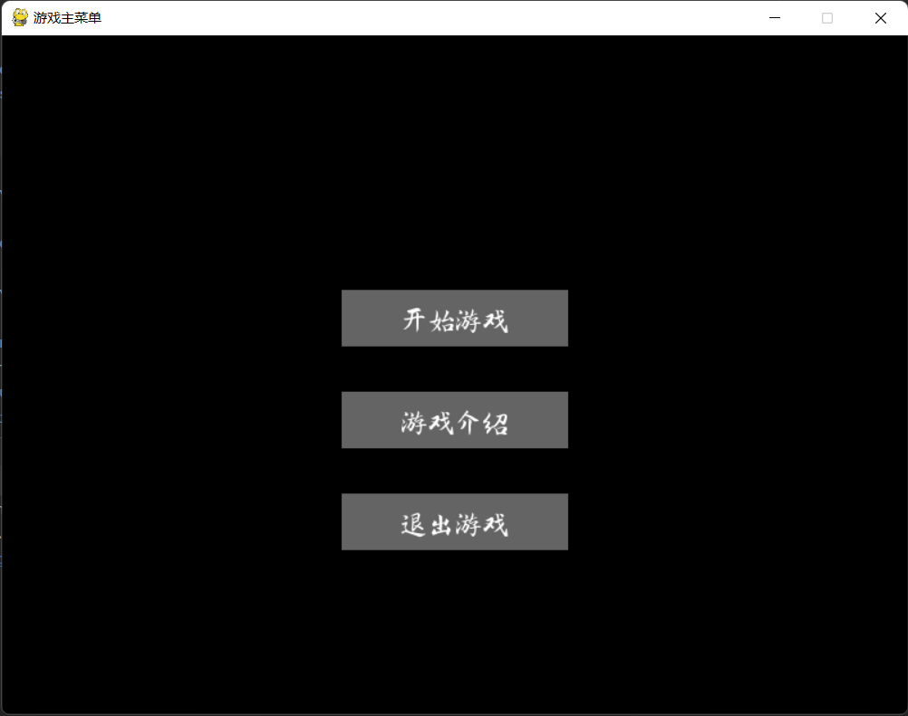
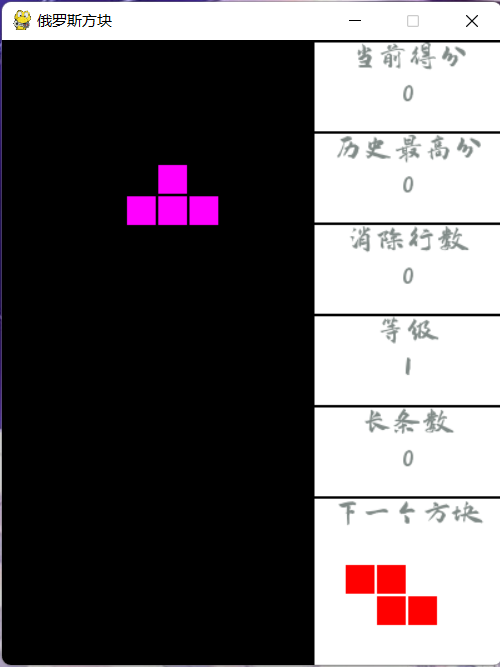

# tetris
## 项目简介
模拟经典版俄罗斯方块功能的俄罗斯方块小游戏
  
## 运行说明
将项目下载后，运行__init__.py文件即可  
出现如下图所示界面即为成功运行
  
### 主界面按钮说明
- 开始游戏：开始一次游戏
- 游戏介绍：游戏窗口切换到对游戏的介绍界面
- 退出游戏：退出游戏  
### 游戏介绍界面  
如下图所示，在该界面会对游戏的按键功能等情况进行说明  
  
### 游戏运行界面说明  
  
游戏运行界面右侧是侧面板，从上到下依次提示当前得分，历史最高分，消除行数，当前的游戏等级，目前出现的长条数，以及下一个方块是什么
